# Open-Eywa System Presentation

This is a visual walkthrough of how the **current** `Open-Eywa` system works.

It is grounded in:

- `OPEN-EYWA-GOAL-AND-OVERVIEW.md`
- `OPEN-EYWA-IMPLEMENTATION-DETAILS.md`
- the current code under `system/`

---

## 1. North Star

Open-Eywa is a **node-first, contract-first, simulation-first** agent system.

The core idea is simple:

- the **node** is the durable unit of work
- the **orchestrator** owns protocol and correctness
- the **runtime** executes one role at a time inside a node
- the **mission folder** stores the real history

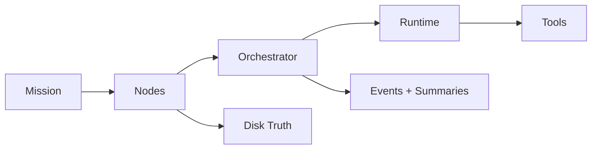

---

## 2. The Main Mental Model

Open-Eywa is not primarily:

- a prompt bundle
- a hidden agent cloud
- a chat loop with extra steps

It is primarily:

- a **filesystem-based execution system**
- where **code enforces protocol**
- and **models act inside bounded roles**

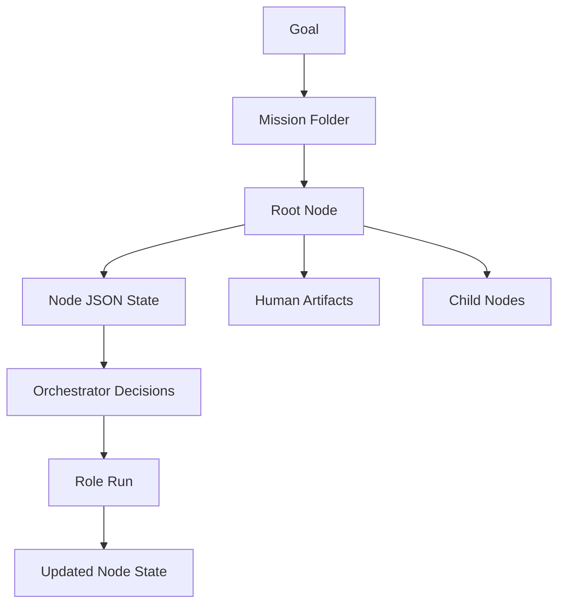

---

## 3. Top-Level Architecture

```text
open-eywa/
├── OPEN-EYWA-GOAL-AND-OVERVIEW.md
├── BUILDING-PRINCIPLES.md
├── OPEN-EYWA-IMPLEMENTATION-DETAILS.md
├── OPEN-EYWA-SYSTEM-PRESENTATION.md
├── stuff-for-agents/
├── missions/
├── validation-suite/
└── system/
```

Main runtime/build areas:

- `system/orchestrator/`
- `system/runtime/`
- `system/tools/`
- `stuff-for-agents/`
- `validation-suite/`

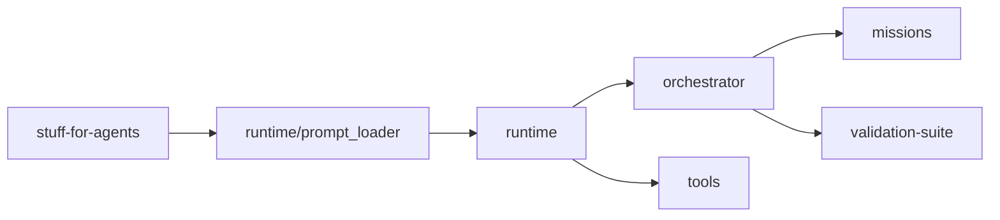

---

## 4. What A Mission Is

A mission is one top-level run.

It has:

- a mission goal
- a root node
- a mission-level summary
- mission-level events

```text
missions/<mission-id>/
├── mission-goal.md
├── system/
│   ├── mission-events.jsonl
│   └── mission-summary.json
└── tree/
    └── root/
```

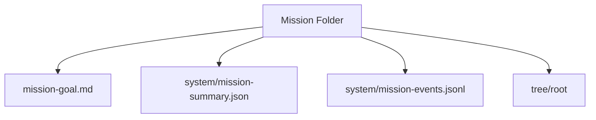

---

## 5. What A Node Is

A node is the durable unit of:

- work
- state
- truth
- recovery
- measurement

Each node has four main areas:

- `input/`
- `output/`
- `system/`
- `children/`

```text
tree/root/
├── input/
├── output/
├── system/
│   └── node.json
└── children/
```

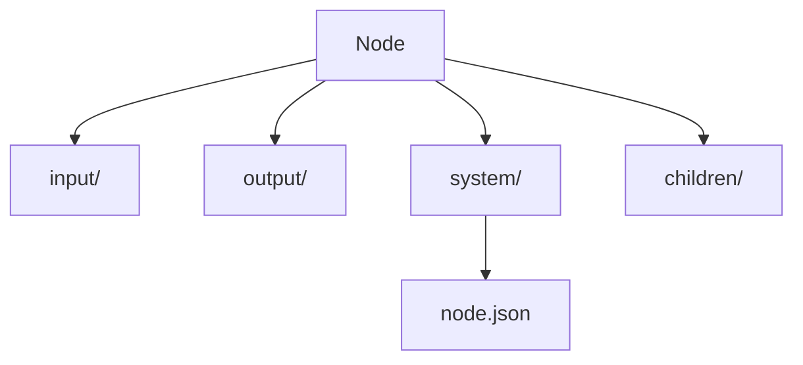

---

## 6. The Big Shift: `system/node.json`

The current system now centers node machine state in:

- `system/node.json`

This replaced the old split `for-orchestrator/` control surface for new missions.

`node.json` now holds:

- lifecycle state
- control state
- progression state
- resolved parameters

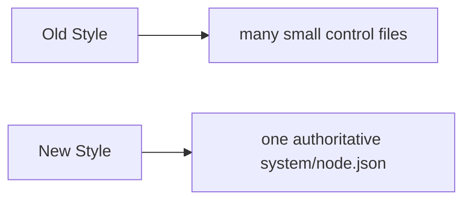

Current high-level shape:

```json
{
  "schema_version": 1,
  "identity": {},
  "task": {},
  "lifecycle": {},
  "control": {},
  "parameters": {},
  "progression": {}
}
```

---

## 7. Node Anatomy

### Human-facing files

- `input/goal.md`
- `input/parent-instructions.md`
- `input/context.md`
- `output/plan.md`
- `output/review.md`
- `output/state.md`
- `output/final-output.md`
- `output/escalation.md`

### Machine-facing state

- `system/node.json`
- `system/events.jsonl`
- `system/runs/run-XXX/...`
- `system/usage-summary.json`
- `system/cost-summary.json`
- `system/recoveries/recovery-XXX/...`

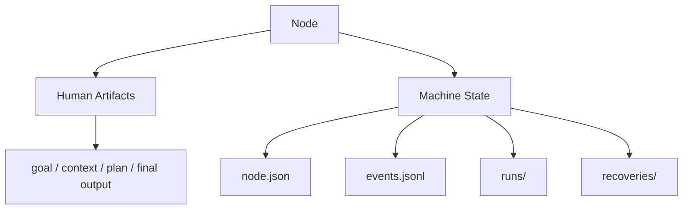

---

## 8. Lifecycle Model

Current statuses:

- `pending`
- `active`
- `waiting_on_computation`
- `finished`
- `failed`

Current terminal outcomes:

- `completed`
- `escalated`
- `cancelled`

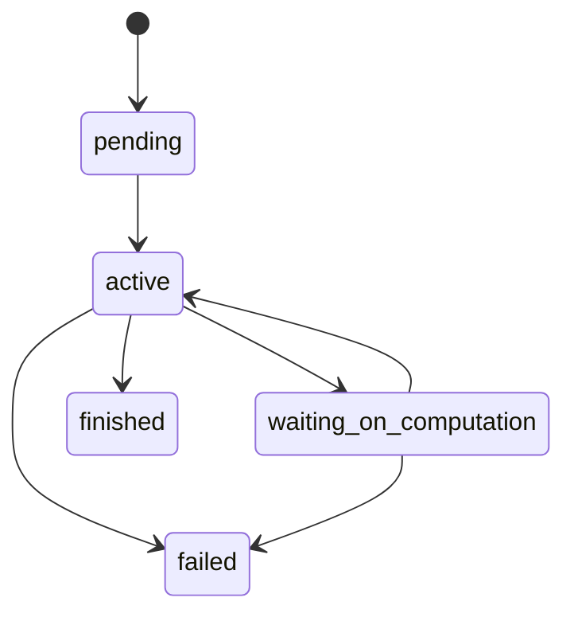

Important rule:

- completion is based on required artifacts and code-side validation
- not on whether the model “sounds done”

---

## 9. Role Model

A node is durable.
A role run is temporary.

Current important roles:

- `planner`
- `worker`
- `mid-plan-evaluator`
- `synthesizer`

The orchestrator picks a role, runs it once, validates the result, then updates `node.json`.

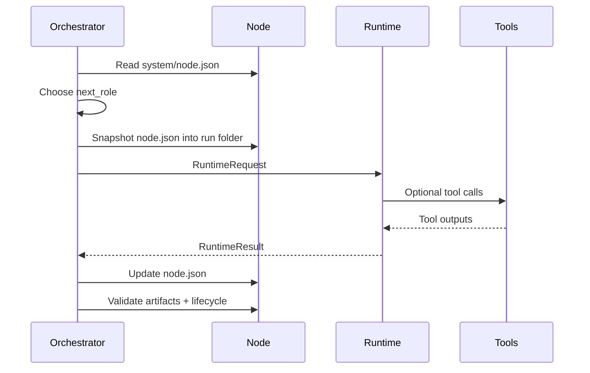

---

## 10. Single-Node Run Flow

This is the simplest path:

- node starts `pending`
- orchestrator runs a role
- runtime writes artifacts
- orchestrator validates
- node ends `finished` or `failed`

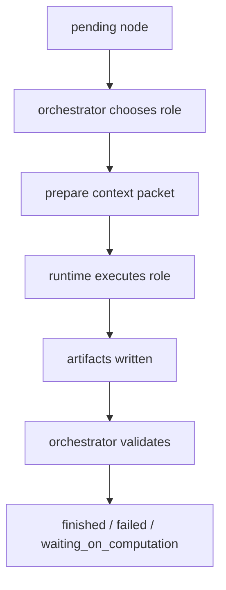

---

## 11. Planned Parent Flow

For decomposition work, the parent node usually does this:

1. `planner` writes `output/plan.md`
2. orchestrator parses the plan into steps
3. child nodes are created
4. child nodes run to stable states
5. `mid-plan-evaluator` decides what to do next
6. when all steps are done, `synthesizer` produces final output

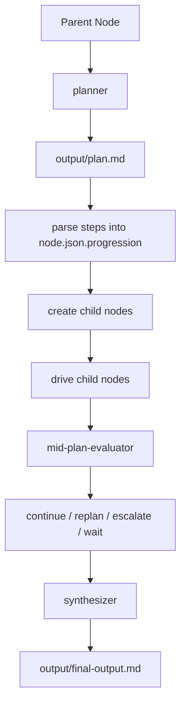

---

## 12. Child Node Creation

Each child gets:

- its own folder
- its own `system/node.json`
- inherited context from the parent
- a child-specific goal

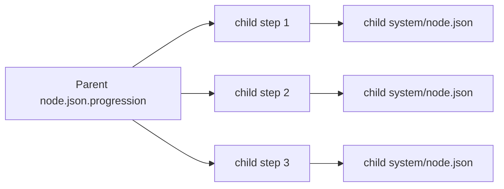

The orchestrator also builds `input/context.md` for children from:

- parent task
- parent plan
- parent state
- prior child results

---

## 13. Runtime Seam

The orchestrator does not talk directly to OpenRouter logic.

It talks to a runtime interface.

Current runtime implementations:

- `SimulatedRuntime`
- `OpenRouterRuntime`

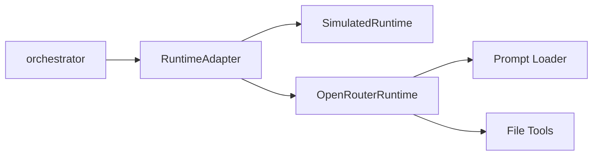

Why this matters:

- tests use the same seam as real runs
- offline and live paths stay structurally aligned

---

## 14. Prompt And Tool Flow

The live runtime currently:

- loads prompt bundles from `stuff-for-agents/`
- sends prepared inputs to the model
- exposes a small safe file-tool surface

Current live file tools:

- `read_file`
- `write_file`
- `edit_file`
- `glob`
- `grep`

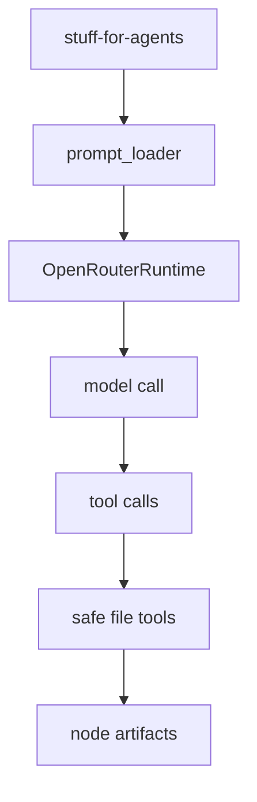

---

## 15. What Gets Recorded

Every serious run leaves a real trail on disk.

At node level:

- `system/node.json`
- `system/events.jsonl`
- `system/runs/run-XXX/request.json`
- `system/runs/run-XXX/result.json`
- `system/runs/run-XXX/summary.json`
- `system/runs/run-XXX/node.json`
- `system/usage-summary.json`
- `system/cost-summary.json`

At mission level:

- `system/mission-events.jsonl`
- `system/mission-summary.json`

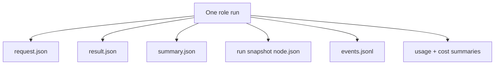

---

## 16. Recovery And Waiting

The system can now explicitly handle:

- waiting on computation
- resuming after a result exists
- cancellation
- fresh attempts / retries

Recovery snapshots are stored under:

- `system/recoveries/recovery-XXX/`

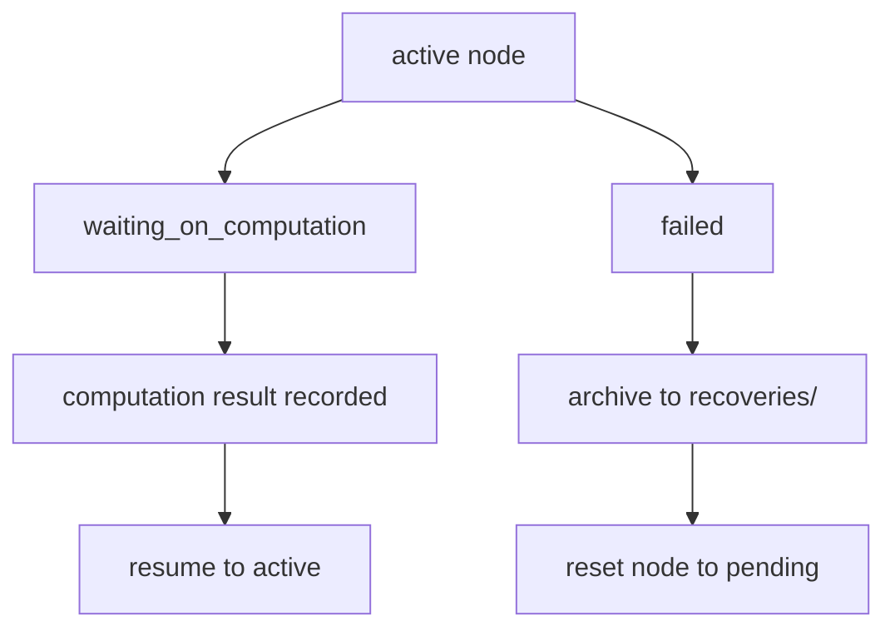

---

## 17. Validation Model

There are three main validation layers.

### Contract tests

Do the hard invariants hold?

### Adversarial tests

Does the system stay safe under ugly weird cases?

### Scenario tests

Can the real orchestrator drive realistic flows through the simulated runtime?

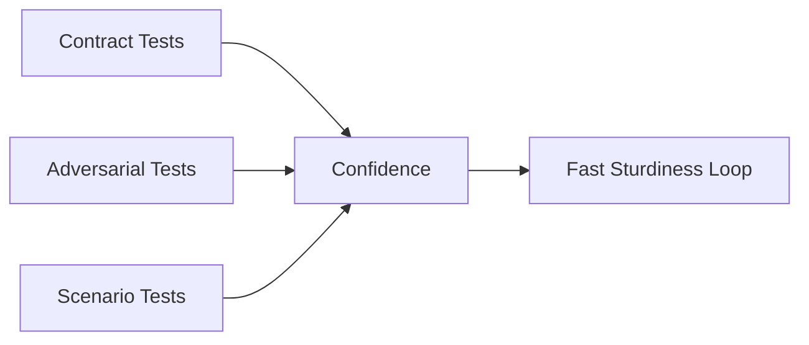

Fast command:

```bash
python3 system/scripts/run_fast_sturdiness_suite.py
```

---

## 18. Live Confidence Model

The system now has two confidence modes:

### Offline confidence

- simulated runtime
- deterministic fixtures
- fast sturdiness loop

### Live confidence

- tiny real OpenRouter canaries
- cheap, small, controlled runs

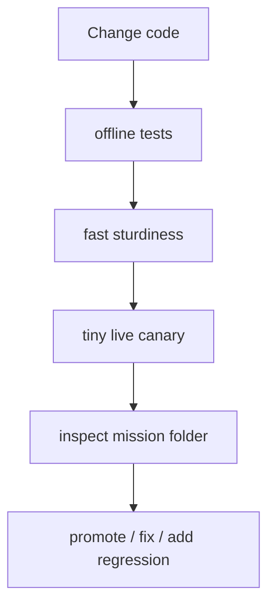

---

## 19. What Is Proven Right Now

The current rebuild has already proven:

- the node-first architecture is real
- `system/node.json` works as the authoritative node record
- the offline orchestrator is real
- the runtime seam is real
- the safe file-tool layer is real
- the single-node live canary path works
- the multi-step planner/worker/evaluator/synthesizer live tree path works

This means Open-Eywa is no longer just a concept or prototype sketch.

It is now a **working, testable execution system**.

---

## 20. Where Experimentation Fits Next

Experimentation should sit **on top of** this architecture, not replace it.

That means:

- `missions/` stays the source of truth
- `node.json` records resolved per-node settings
- experiment assignment and reporting layer sits above normal mission execution

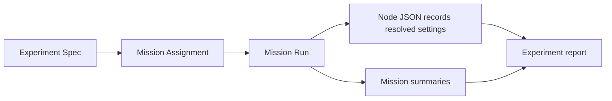

---

## 21. Current One-Sentence Summary

Open-Eywa currently works like this:

**A mission creates a root node, the orchestrator drives roles through a runtime seam, node truth lives in `system/node.json`, results and history are recorded on disk, and the whole system is validated through contract tests, adversarial tests, scenario tests, and small live canaries.**

